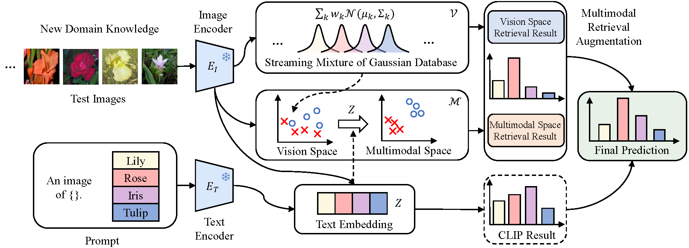

# Test-Time Retrieval-Augmented Adaptation for Vision-Language Models

Official implementation of the paper: "Test-Time Retrieval-Augmented Adaptation for Vision-Language Models" [ICCV 2025].

## Overview

> **<p align="justify"> Abstract:** Vision-language models (VLMs) have shown promise in test-time adaptation tasks due to their remarkable capabilities in understanding and reasoning about visual content through natural language descriptions. However, training VLMs typically demands substantial computational resources, and they often struggle to adapt efficiently to new domains or tasks. Additionally, dynamically estimating the test distribution from streaming data at test time remains a significant challenge. In this work, we propose a novel test-time retrieval-augmented adaptation (TT-RAA) method that enables VLMs to maintain high performance across diverse visual recognition tasks without the need for task-specific training or large computational overhead. 
During inference, TT-RAA employs a streaming mixture of Gaussian database (SMGD) to continuously estimate test distributions, requiring minimal storage. Then, TT-RAA retrieves the most relevant information from the SMGD, enhancing the original VLM outputs. A key limitation of CLIP-based VLMs is their inter-modal vision-language optimization, which does not optimize vision-space similarity, leading to larger intra-modal variance. To address this, we propose a multimodal retrieval augmentation module that transforms the SMGD into a unified multimodal space, enabling retrieval that aligns both vision and language modalities. Extensive experiments across both cross-domain and out-of-distribution benchmarks comprising fourteen datasets demonstrate TT-RAA’s superior performance compared to state-of-the-art methods. Ablation studies and hyperparameter analyses further validate the effectiveness of the proposed modules.

## Requirements 
### Installation
Follow these steps to set up a conda environment and ensure all necessary packages are installed:

```bash
git clone https://github.com/xinqi-fan/TT-RAA.git
cd TT-RAA

conda create -n ttraa
conda activate ttraa

conda install pytorch==1.12.1 torchvision==0.13.1 torchaudio==0.12.1 cudatoolkit=11.3 -c pytorch

pip install -r requirements.txt
```

### Dataset
To set up all required datasets, kindly refer to the guidance in [DATASETS.md](docs/DATASETS.md), which incorporates steps for two benchmarks.

## Run
### Configs
The configuration for hyperparameters in `configs/dataset.yaml` can be tailored within the provided file to meet the needs of various datasets.

### Running
To execute the TT-RAA, navigate to the `scripts` directory, where you'll find 2 bash scripts available. Each script is designed to apply the method to two benchmarks. The scripts process the datasets sequentially, as indicated by the order divided by '/' in the script. 

#### Cross-Domain Benchmark
* Run on the Cross-Domain Benchmark.
```
bash ./scripts/run_cd_benchmark.sh 
```

#### OOD Benchmark
* Run on the OOD Benchmark.
```
bash ./scripts/run_ood_benchmark.sh 
```

## Citation
```bibtex
@inproceedings{fan2025test,
  title={Test-Time Retrieval-Augmented Adaptation for Vision-Language Models},
  author={Fan, Xinqi and Chen, Xueli and Yang, Luoxiao and Qureshi, Rizwan and Dou, Qi and Yap, Moi Hoon and Shah, Mubarak},
  booktitle={Proceedings of the IEEE/CVF International Conference on Computer Vision},
  year={2025}
}
```

## Contact
If you have any questions, feel free to create an issue in this repository or contact us via email at x.fan@mmu.ac.uk.

## Acknowledgements
We sincerely thank the authors of [Tip-Adapter](https://github.com/gaopengcuhk/Tip-Adapter), [TPT](https://github.com/azshue/TPT), [CoOp/CoCoOp](https://github.com/KaiyangZhou/CoOp), [SuS-X](https://github.com/vishaal27/SuS-X), and [TDA](https://github.com/kdiAAA/TDA) for openly sharing their implementations and offering comprehensive guidance on dataset preparation.
